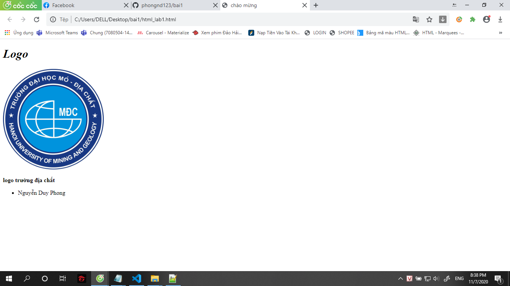

# html_lab1
```html
<!DOCTYPE html>
<html lang="en">
<head>
    <meta charset="UTF-8">
    <meta name="viewport" content="width=device-width, initial-scale=1.0">
    <title>chào mừng</title>
    <link rel="stylesheet" type="text/css" href="style.css"/>
</head>
<body>
    <div class="container">
            <h1><em>Lô Gô trường Mỏ Địa Chất</em></h1>
            
            <p><strong>logo trường mỏ địa chất</strong></p>
        
    </div>
    <div>
        <ul>
            <li>Nguyễn Duy Phong</li>
        </ul>
    </div>
</body>
</html>
```
##giao dien

